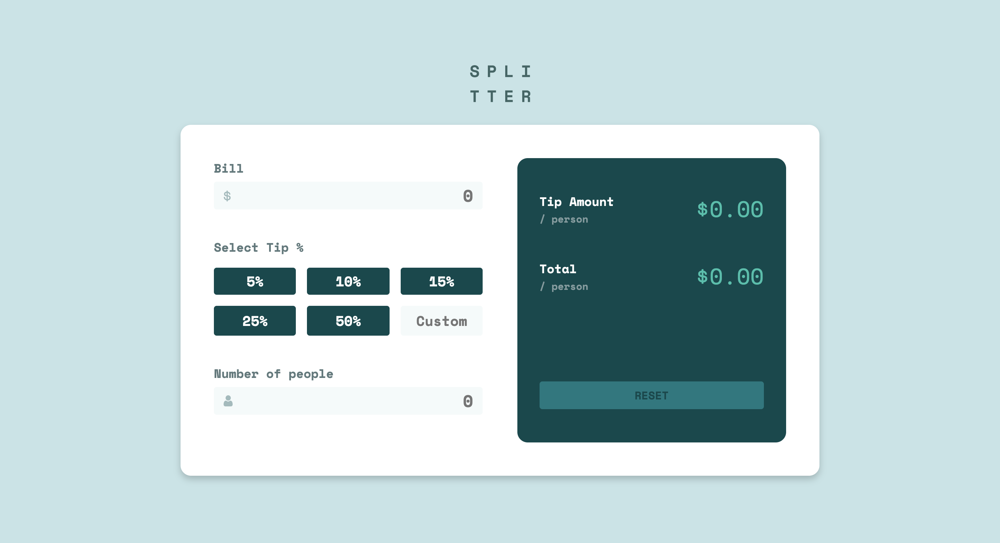
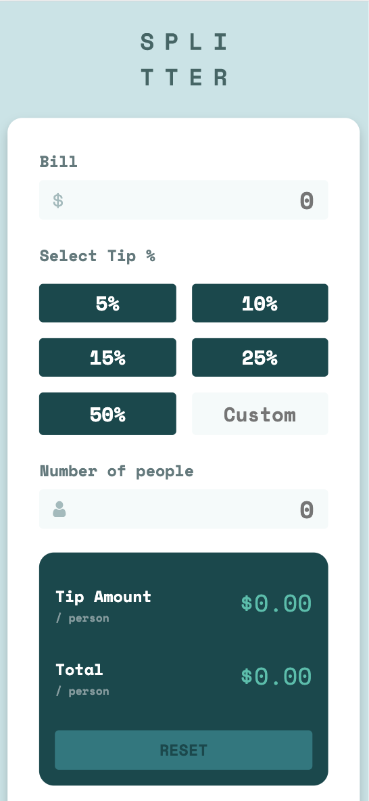

# Frontend Mentor - Tip calculator app solution

This is my solution to the [Tip calculator app challenge on Frontend Mentor](https://www.frontendmentor.io/challenges/tip-calculator-app-ugJNGbJUX). 

## Overview

Users should be able to:

- View the optimal layout for the app depending on their device's screen size
- See hover states for all interactive elements on the page
- Calculate the correct tip and total cost of the bill per person

### Screenshots

   
   

### Links

- Solution URL: [https://www.frontendmentor.io/solutions/tip-calculator-app-7fT5t2eH8](https://www.frontendmentor.io/solutions/tip-calculator-app-7fT5t2eH8)
- Live Site URL: [https://ellieroy.github.io/tip-calculator/](https://ellieroy.github.io/tip-calculator/)

### Built with

- Semantic HTML5 markup
- CSS & SCSS 
- Flexbox
- CSS Grid
- Mobile-first workflow
- Vanilla Javascript

## Author

- Frontend Mentor - [@ellieroy](https://www.frontendmentor.io/profile/ellieroy)
